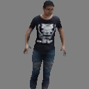

# RefineTex

### [Paper](https://arxiv.org/pdf/2303.03471.pdf) | [arXiv](https://arxiv.org/abs/2303.03471) | [Website](https://www.cs.bilkent.edu.tr/~adundar/projects/RefineTex/)


## Abstract

Estimating 3D human texture from a single image is essential in graphics and vision. It requires learning a mapping function from input images of humans with diverse poses into the parametric uv space and reasonably hallucinating invisible parts. To achieve a high-quality 3D human texture estimation, we propose a framework that adaptively samples the input by a deformable convolution where offsets are learned via a deep neural network. Both offsets and the deformable convolution are deeply supervised.

Additionally, we describe a novel cycle consistency loss that improves view generalization. We further propose to train our framework with an uncertainty-based pixel-level image reconstruction loss, which enhances color fidelity.

We compare our method against the state-of-the-art approaches and show significant qualitative and quantitative improvements.

## Method


The overall framework. We introduce a deformable convolution-based refinement module where offsets are learned via an attention-based deep network Xu et. al. 2021. TThis framework can handle the challenges of mapping unaligned spatially diverse input images into fixed parametric uv coordinates.

## Results
<table>
    <tr>
        <td></td>
        <td></td>
        <td></td>
        <td></td>
        <td></td>
    </tr>
    <tr>
        <td></td>
        <td></td>
        <td></td>
        <td></td>
        <td></td>
    </tr>
    <tr>
        <td></td>
        <td></td>
        <td></td>
        <td></td>
        <td></td>
    </tr>
    <tr>
        <td><h4>Input</h4></td>
        <td><h4>HPBTT</h4></td>
        <td><h4>RTSG</h4></td>
        <td><h4>Texformer</h4></td>
        <td><h4>Ours</h4></td>
    </tr>
</table>

## Citation

```
@article{altindis2023refining,
  title={Refining 3D Human Texture Estimation from a Single Image},
  author={Altindis, Said Fahri and Meric, Adil and Dalva, Yusuf and Gudukbay, Ugur and Dundar, Aysegul},
  journal={arXiv preprint arXiv:2303.03471},
  year={2023}
}
```
